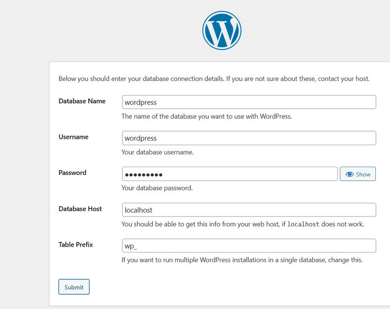

# Lucrare de laborator 5: Rularea site-ului într-un container

## Scopul lucrării
După executarea acestei lucrări, voi fi capabil să pregătesc un container Docker pentru a rula un site web bazat pe Apache HTTP Server, PHP (mod_php) și MariaDB. 

## Sarcina
- Crearea unui fișier `Dockerfile` pentru a construi o imagine a containerului.
- Instalarea și configurarea Apache, PHP și MariaDB.
- Instalarea și configurarea WordPress.
- Stocarea bazei de date MariaDB într-un volum montat.
- Verificarea funcționării site-ului WordPress.

## Descrierea execuției lucrării

### 1. Executare
Am creat un director `containers04` și am adăugat următoarele subdirectoare:
```
containers04/
│── files/
│   ├── apache2/
│   ├── php/
│   ├── mariadb/
```

Am creat fișierul `Dockerfile` cu următorul conținut:
```dockerfile
# create from debian image
FROM debian:latest

# install apache2, php, mod_php for apache2, php-mysql and mariadb
RUN apt-get update && \
    apt-get install -y apache2 php libapache2-mod-php php-mysql mariadb-server && \
    apt-get clean
```
Am creat imaginea apache2-php-mariadb


Am creat un container Apache2-PHP-MariaDB din imaginea apache2-php-mariadb și l-am pornit în modul de fundal cu comanda bash


Am copiat fișierele de configurare Apache2, PHP și MariaDB din container în directorul files/ de pe computer. Pentru a face acest lucru, în contextul proiectului:


Am verificat fișierele de configurare apache2, php, mariadb


Am oprit și șters containerul apache2-php-mariadb


### 2. Configurarea
Am deschis fișierul files/apache2/000-default.conf și am efectuat următoarele modificări:

Am înlocuit #ServerName www.example.com cu ServerName localhost.

Am modificat linia ServerAdmin webmaster@localhost, înlocuind adresa de e-mail cu a mea.

După linia DocumentRoot /var/www/html, am adăugat DirectoryIndex index.php index.html


Am deschis fișierul files/apache2/apache2.conf și am adăugat la sfârșitul acestuia linia ServerName localhost


Am deschis fișierul files/php/php.ini și am  înlocuit ;error_log = php_errors.log cu error_log = /var/log/php_errors.log, am setat parametrii:
1. memory_limit = 128M
2. upload_max_filesize = 128M
3. post_max_size = 128M
4. max_execution_time = 120


Am deschis fișierul files/mariadb/50-server.cnf, am găsit linia #log_error = /var/log/mysql/error.log și am eliminat # din fața ei.


### 3. Crearea scriptului de pornire

Am creat directorul files/supervisor și fișierul supervisord.conf cu următorul conținut:


### 4. Crearea Dockerfile

Am deschis fișierul Dockerfile și am adăugat următoarele modificări

- Montarea volumelor imediat după FROM ...:


- Instalarea Supervisor în instrucțiunea RUN:


- Copierea și dezarhivarea site-ului WordPress:


- Copierea fișierelor de configurare Apache2, PHP, MariaDB și Supervisor:


- Crearea directorului pentru socket-ul MySQL și setarea permisiunilor:


- Deschiderea portului 80:


- Comanda de pornire Supervisor:


Am creat imaginea containerului cu numele apache2-php-mariadb folosind comanda:

```bash
docker build -t apache2-php-mariadb .
```

Am pornit containerul apache2-php-mariadb în modul de fundal folosind comanda:

```bash
docker run -d --name apache2-php-mariadb apache2-php-mariadb
```

Am verificat dacă site-ul WordPress este disponibil la adresa http://localhost/


Am verificat dacă fișierele site-ului WordPress sunt prezente în directorul /var/www/html/


### 5. Crearea bazelor de date și a utilizatorului pentru WordPress
M-am conectat la container și am creat baza de date WordPress:
```bash
docker exec -it apache2-php-mariadb mysql
CREATE DATABASE wordpress;
CREATE USER 'wordpress'@'localhost' IDENTIFIED BY 'wordpress';
GRANT ALL PRIVILEGES ON wordpress.* TO 'wordpress'@'localhost';
FLUSH PRIVILEGES;
EXIT;
```


### 6. Crearea fișierului de configurare WordPress
Am accesat `http://localhost/`, am urmat pașii de instalare. La pasul 2, am specificat următoarele date:



Am copiat fișierul `wp-config.php` în `files/wp-config.php`


### 7. Adăugarea fișierului de configurare WordPress în Dockerfile

Am adăugat în fișierul Dockerfile următoarele linii:


### 8. Pornirea și testarea

Am recreat imaginea containerului, am pornit containerul și am verificat funcționarea site-ului WordPress.


### Răspunsuri la întrebări

1. **Ce fișiere de configurare au fost modificate?**
   - `files/apache2/000-default.conf`
   - `files/apache2/apache2.conf`
   - `files/php/php.ini`
   - `files/mariadb/50-server.cnf`
   - `files/supervisor/supervisord.conf`
   - `files/wp-config.php`

2. **Pentru ce este responsabilă instrucția `DirectoryIndex` din fișierul de configurare Apache?**
   - Aceasta definește fișierul implicit care va fi servit atunci când un utilizator accesează un director. În acest caz, serverul va căuta `index.php` sau `index.html`.

3. **De ce este necesar fișierul `wp-config.php`?**
   - Conține setările esențiale pentru ca WordPress să se conecteze la baza de date și să funcționeze corect.

4. **Pentru ce este responsabil parametrul `post_max_size` din fișierul de configurare PHP?**
   - Definește dimensiunea maximă permisă pentru datele trimise printr-o solicitare POST, inclusiv fișiere încărcate prin formulare.

5. **Care sunt deficiențele imaginii containerului creat?**
   - Nu are un mecanism de backup automat pentru baza de date.
   - Nu implementează măsuri de securitate avansate pentru MySQL.

## Concluzii
Am reușit să creez un container Docker care rulează Apache, PHP și MariaDB și găzduiește un site WordPress funcțional. Am învățat cum să configurez serviciile necesare și să gestionez configurarea unui mediu de dezvoltare web într-un container Docker.
